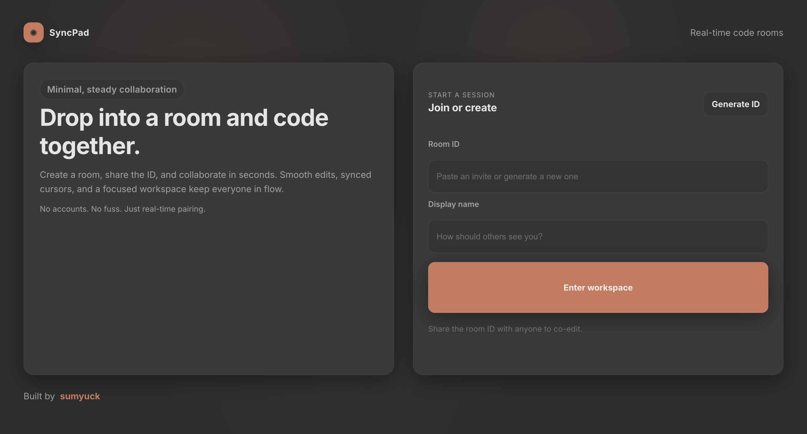
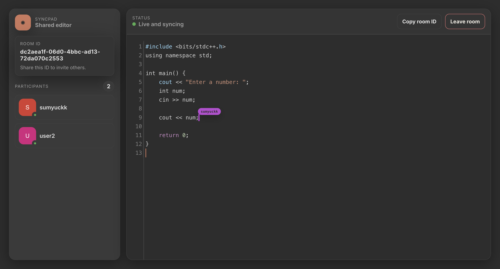

# SyncPad

<div align="center">

**Real-time collaborative code editor for seamless team coding**

[](https://syncpad-4ciq.onrender.com)
[](https://github.com/sumyuck/SyncPad)

*Lightweight • Fast • Real-time • Minimalist*

</div>

---

## ✨ Features

- 🚀 **Real-time Collaboration** - Multiple users edit code simultaneously with instant synchronization
- 💬 **WebSocket Communication** - Bidirectional communication using Socket.IO for seamless updates
- 🎨 **Professional Editor** - CodeMirror with syntax highlighting and dark theme
- 👥 **User Presence** - See who's connected in real-time
- 🔗 **Room-based Sessions** - Create or join rooms using unique Room IDs
- 🎯 **Minimalist UI** - Clean, focused interface inspired by Claude's design

---

## 🖼️ Screenshots

### Home Screen
<p align="center">
  
</p>

### Collaborative Editor
<p align="center">
  
</p>

---

## 🛠️ Tech Stack

| Category | Technologies |
|----------|-------------|
| **Frontend** | React, CodeMirror 5, React Router, react-hot-toast |
| **Backend** | Node.js, Express |
| **Real-time** | Socket.IO |
| **Styling** | CSS with Claude-inspired design |

---

## 🚀 Quick Start

### Prerequisites
- Node.js (v14 or higher)
- npm or yarn

### Installation

```bash
# Clone the repository
git clone https://github.com/sumyuck/SyncPad.git
cd SyncPad

# Install dependencies
npm install

# Start development server
npm run dev
```

Open [http://localhost:3000](http://localhost:3000) in your browser.

### Usage

1. **Create a Room**: Click "new room" to generate a unique Room ID
2. **Join a Room**: Enter a Room ID and your username, then click "Join"
3. **Share**: Copy the Room ID and share it with collaborators
4. **Code Together**: All changes sync in real-time across all connected users

---

## 📜 Available Scripts

| Command | Description |
|---------|-------------|
| `npm run dev` | Start both frontend and backend in development mode |
| `npm run server` | Start only the backend server (with nodemon) |
| `npm run start:frontend` | Start only the frontend React app |
| `npm run build` | Build the React app for production |
| `npm start` | Start the production server (serves built React app) |

---

## 🌐 Deployment

SyncPad deploys as a **single Node.js service** that serves:
- The production React build
- The Express backend
- The Socket.IO WebSocket server

### Deploy to Render

1. **Create a Web Service** on [Render](https://render.com)
2. **Connect your GitHub repository**
3. **Configure:**
   - **Build Command**: `npm install && npm run build`
   - **Start Command**: `npm start`
   - **Environment**: Node
4. **Deploy** - No environment variables needed!

The app will be available at your Render service URL.

---

## 📁 Project Structure

```
SyncPad/
├── public/          # Static assets and logos
├── src/
│   ├── components/  # React components (Client, Editor)
│   ├── pages/       # Page components (Home, EditorPage)
│   └── ...
├── server.js        # Express server
├── socketHandler.js # Socket.IO event handlers
└── package.json
```

---

## 🎨 Design Philosophy

SyncPad features a minimalist, Claude-inspired design with:
- **Dark theme** with carefully chosen color palette
- **Orange-red accents** (`#FF6B35`) for interactive elements
- **Clean typography** and spacing for optimal focus
- **Responsive layout** that works on all screen sizes

---

## 📝 License

This project is private and proprietary. Contact the author before reuse.

---

## 👤 Author

**sumyuck**

- GitHub: [@sumyuck](https://github.com/sumyuck)
- Project: [SyncPad](https://github.com/sumyuck/SyncPad)

---

<div align="center">

**Built with ❤️ using React, Node.js, and Socket.IO**

[⬆ Back to Top](#syncpad)

</div>
